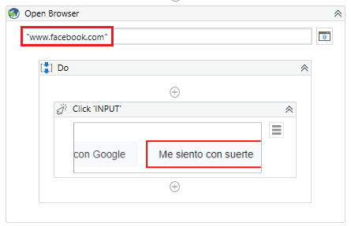

# Ejemplo 01: Automatizando Facebook

## 1. Objetivos :dart:

- Conocer .................

## 2. Requisitos :gear:

1. Tener instalado UiPath Studio.

## 3. Desarrollo :hammer:

1. Crear el archivo ***FacebookLogin***.xaml (con el flujo de trabajo *Sequence*).

2. Añadir la actividad ***Open Browser*** y escribir: **`"www.facebook.com"`**

 

3. Ir a las propiedades de la actividad ***Open Browser*** y escribir lo siguiente: 

    - *Input > BrowserType*: **BrowserType.Chrome**

 

4. Cerrar los navegadores web **Chrome**

5. Modificar el contenido de la actividad ***Open Browser*** y escribir: **`www.facebook.com`**

7. Ejecutar el flujo y ver los resultados.

8. Modificar el contenido de la actividad ***Open Browser*** y escribir: **`www.google.com`**. Seleccionar el botón que se indica en la siguiente imagen:

 

9. Añadir la actividad ***Click*** y seleccionar la opción ***Indicate element inside browser***.

 

10. Posicionar el cursor sobre el botón **Me siento con suerte** y dar clic.

 

11. Cerrar los navegadores web **Chrome**

12. Ejecutar el flujo y ver los resultados.

13. Cerrar los navegadores web **Chrome**

14. Modificar el contenido de la actividad ***Open Browser*** y escribir: **`www.facebook.com`**

 

15. Ir a las propiedades de la actividad ***Click*** y escribir lo siguiente:

    - *Input > Target > Timeout (miliseconds):* **`5000`**

 

16. Añadir la actividad ***Message Box*** y escribir: **`"CONTINUA"`**

 

17. Ejecutar el flujo y ver los resultados.

 

